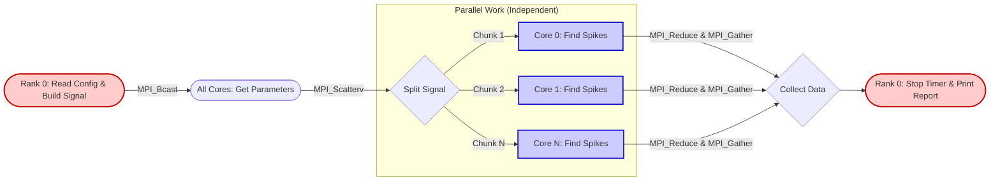

# Signal Spike Detector - MPI Python Project

This is a simple Python project using `mpi4py`. The goal is to use MPI to analyze a massive data signal to find anomalous energy spikes. The workload is spread across different cores to process data as fast as possible.

### How it works

Here is the step-by-step flow of the program:

1. **Setup (`bcast`)**:
The Master process (Rank 0) reads a file called `config.txt` to get the simulation parameters. It then shares this information with all other processes.
2. **Data Creation & Splitting (`Scatterv`)**:
Rank 0 creates a huge array of random noise (the signal) and injects a few fake high peaks. It then cuts this array into equal pieces and sends one piece to each core.
3. **The Calculation (Parallel Work)**:
Every core works alone on its piece of the signal. It looks at a "sliding window" of data points to calculate the local average. If a point is much higher than the average, the core counts it as a spike.
4. **Global Results (`reduce`)**:
Each core send the number of spikes it found in its chunk and what the highest peak was. `MPI_SUM` and `MPI_MAX` are used to get the final totals instantly.
5. **Final Report (`Gather`)**:
Rank 0 tracks the overall simulation time using a global timer. Then, every core sends its ID (Rank) and its local spike count to Rank 0 using a `Gather` operation. Finally, Rank 0 prints the total execution time and a table showing how many spikes each core found.

---

### The Configuration File

The program needs a `config.txt` file in the same folder. If you don't make one, the script will create it automatically. It looks like this:

```text
total_samples=1000000
window_size=1000
threshold=5.0
```

* **total_samples:** How long the signal is.

* **window_size:** How many points to use for the moving average.

* **threshold:** How many times a signal must be bigger than the average to be counted as a spike.

A final scaling analysis is performed to evaluate the performance of the parallelization. Increasing the window size, the amount of computational effort required by each core increases. This is very useful to analyze strong scaling behaviour. On the other hand, increasing total samples and number of cores (eg. doubling both) is very useful to analyze the weak scaling behaviour. The results of this analysis are availiable in the dedicated folder.

---

### Program Flow Diagram

