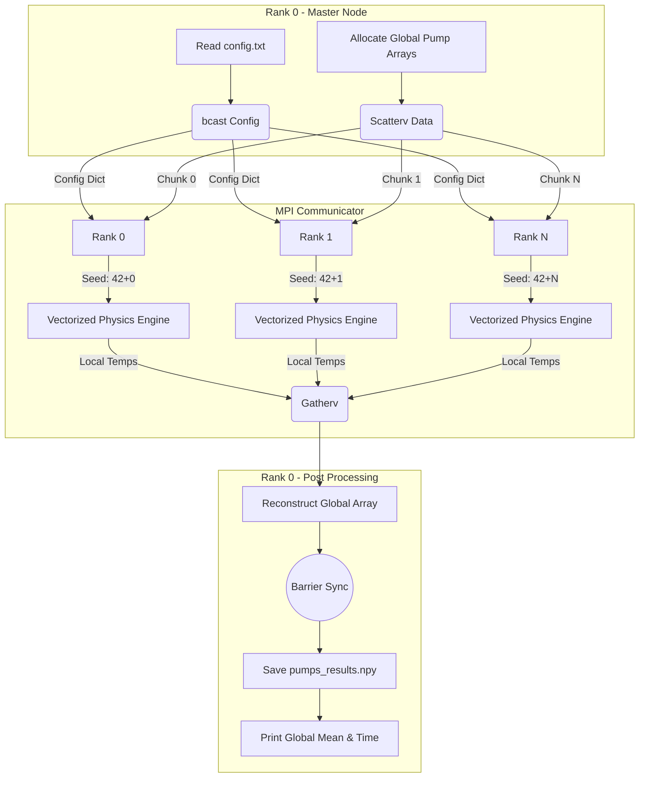

# HPC Case Study: Distributed Industrial Pump Lifecycle Simulation

This document outlines the step-by-step execution of the MPI Python script designed to simulate the lifecycle of industrial pumps using the Data Parallelism paradigm.

## 1. Initialization and Configuration (I/O & Broadcast)

To avoid overloading the file system (a common bottleneck in HPC), file operations are strictly centralized.

* Only the Root process (Rank 0) accesses the disk to read the `config.txt` file containing the simulation parameters (number of pumps, cycles, baseline vibration).
* Once the parameters are loaded into a Python dictionary, Rank 0 uses `comm.bcast` to broadcast this identical dictionary to all other listening processes. At this point, every node knows the rules of the simulation.

## 2. Domain Decomposition (Load Balancing)

The workload must be divided fairly among the available CPU cores. All processes call the `calculate_partitions` function to figure out their share of the workload.

* If the total number of pumps (e.g., 1,000,000) is not perfectly divisible by the number of MPI processes, the algorithm distributes the remainder by assigning one extra pump to the first few processes.
* This function generates two crucial arrays: `counts` (how many elements each process gets) and `displacements` (the starting memory index for each chunk).

## 3. Data Distribution (Scatterv)

Rank 0 allocates the initial global arrays in its memory, representing brand-new pumps with 100% health and zero wear cycles.

* Rank 0 uses `comm.Scatterv` to slice these massive arrays according to the previously calculated counts and displacements, sending the appropriate chunks to the respective workers.
* The uppercase "V" in `Scatterv` is critical: it indicates that mpi4py is operating directly on contiguous C-style memory buffers (NumPy arrays) rather than using Python's standard object serialization. This guarantees maximum data transfer speed.

## 4. The Physics Engine (Parallel Computation)

This is the core computational phase. The workload is "Embarrassingly Parallel," meaning the processes do not need to communicate with each other while calculating.

* **Independent Stochasticity:** Each process initializes a random seed based on its MPI Rank (`42 + rank`). This ensures that the random anomalies generated by the Chaos Engine are unique for each chunk of data, avoiding duplicated simulation results.
* **Time Loop:** For every time step, the vectorized NumPy code calculates the degradation of the pumps using a Weibull-like curve.
* **Temperature Calculation:** As health decreases, vibration increases. Both factors contribute to a steady rise in the pump's temperature. Additionally, a random mask applies sudden heat spikes (+15°C) to 3% of the pumps. The final temperature is the main target variable of our simulation.

## 5. Data Gathering (Gatherv)

Once the time loop finishes, every process holds a local array containing the final temperatures of its specific pumps.

* The processes call `comm.Gatherv` to send their data chunks back to the Root process.
* Using the same `counts` and `displacements` arrays from Step 2, Rank 0 knows exactly where to paste each incoming chunk, seamlessly reconstructing the final `global_temp_results` array in the correct order.

## 6. Synchronization and Output

Before wrapping up, the script calls `comm.Barrier()`. This acts as a checkpoint, forcing the faster processes to wait for the slower ones.

* The barrier ensures that the final timer (`MPI.Wtime()`) accurately reflects the total time required for the entire parallel workload to finish.
* Finally, Rank 0 calculates the global mean temperature, prints the performance report to the terminal, and saves the raw temperature array to the disk (`pumps_results.npy`) for future data visualization or machine learning tasks.

---

## Parallel Execution Flow

